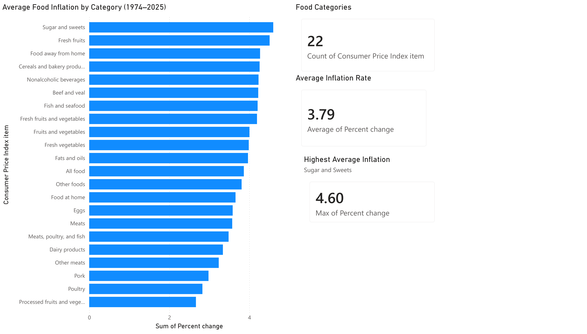
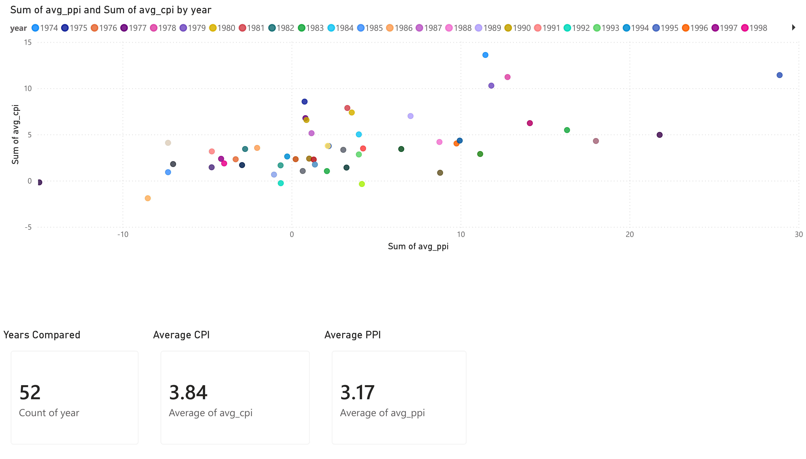
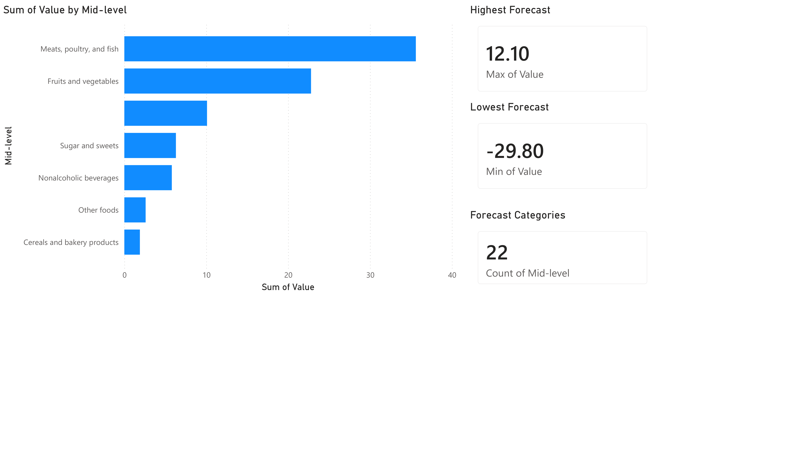

# Food-Price-Forecasting-Analytics
Food price inflation analysis using Python, SQL, and Power BI

## Project Overview

This project analyzes historical Consumer Price Index (CPI) and Producer Price Index (PPI) food price data to identify inflation trends, examine the relationship between CPI and PPI, and evaluate USDA food price forecasts for 2026.

## Tools Used

- Python
- Pandas
- SQL (SQLite)
- Matplotlib
- Power BI

## Project Workflow

### 1. Data Understanding
- Loaded and explored CPI and PPI datasets.
- Performed data cleaning and validation.
- Examined historical food inflation trends.

### 2. KPI Analysis
- Calculated average inflation rates by food category.
- Identified highest and lowest inflation categories.
- Created summary metrics for business reporting.

### 3. SQL Analysis
- Performed filtering, aggregation, and grouping.
- Used SQL joins to combine CPI and PPI datasets.
- Generated yearly CPI vs PPI comparison metrics.

### 4. Forecast Analysis
- Analyzed USDA 2026 food price forecasts.
- Evaluated prediction intervals and uncertainty ranges.
- Identified categories with highest forecast risk.

## Key Findings

- Average food inflation rate: 3.79%
- Total food categories analyzed: 22
- CPI-PPI correlation: 0.59
- Highest historical inflation category: Sugar and Sweets (4.60%)
- Highest forecast inflation category: Meats, Poultry, and Fish
- Largest forecast uncertainty: Eggs

## Power BI Dashboard Pages

### Page 1: Historical CPI Analysis
- Average inflation by category
- Total categories analyzed
- Average inflation rate
- Highest inflation category

### Page 2: CPI vs PPI Analysis
- CPI vs PPI scatter plot
- CPI-PPI correlation analysis
- Average CPI
- Average PPI

### Page 3: Forecast Analysis
- Forecasted inflation by category
- Forecast uncertainty analysis
- Highest forecast category
- Highest uncertainty category

## Repository Structure

```text
dashboard/
│
├── avg_cpi.csv
├── cpi.csv
├── ppi.csv
├── cpi_ppi.csv
└── forecast_uncertainty.csv
```
## Dashboard Screenshots

### Historical CPI Analysis


### CPI vs PPI Analysis


### Forecast Analysis

## Author

Bhavika Gungurthi
M.S. Information Systems
Iowa State University
